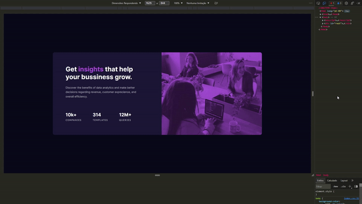

<h1 align="center">Stats Preview Card Component</h1>

## Sobre o Projeto

Layout desenvolvido com base no [design](https://www.frontendmentor.io/challenges/stats-preview-card-component-8JqbgoU62) proposto pelo site [Frontend Mentor](https://www.frontendmentor.io/home).

## Layout

    </img>

## Tecnologias utilizadas

    <h3>Front-end</h3>
    </img>
    </img>
    </img>
    </img>

## Pré-requisitos

<ul>
    <li>
        
        <a href="https://git-scm.com/" rel="external">Git</a>
        (Sistema de Controle de Versão)
    </li>
    <li>
        
        <a href="https://nodejs.org/en/" rel="external">NPM</a>
        (Gerenciador de Pacotes do <strong>Node.js</strong>)
    </li>
</ul>

## Como utilizar

<ol>
    <li>Abra o terminal do Git no diretório onde ficará este projeto.</li>
    <li>Entre com o comando <code>git clone 'https://github.com/riandeolivera/stats-preview-card-component'</code>.</li>
    <li>Instale as dependências necessárias usando <code>npm install</code>.</li>
    <li>Após a instalação, insira <code>npm start</code>.</li>
    <li>Entre na URL <a href="http://localhost:3000">http://localhost:3000</a> pela sua barra de navegação, é onde a aplicação estará rodando.</li>
</ol>

## Desenvolvido em

20 de jan. de 2022

Made with 💙 by Rian Oliveira
